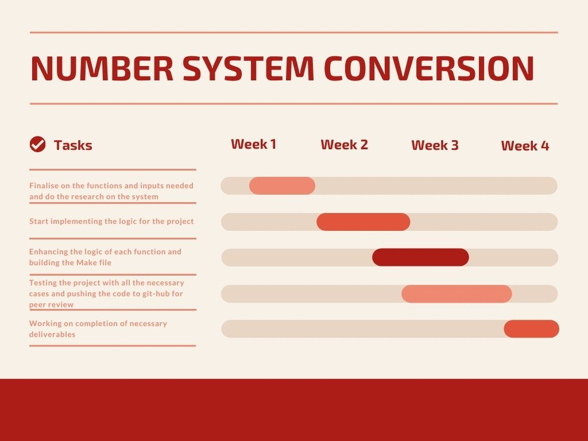

# Requirements
## Introduction
 This project is implemented using the c programming language.The main goal is to convert the given input in one of the number system to another desired number system.

## Research

For digital hardware, the natural numbering system is binary (base 2),but expressing anything in binary causes way too many bits to be used. So, it's not   practical.
Hexadecimal allows us to use 4x fewer bits, so, it is very useful.Besides no processor uses anything less than 4bits, so, hexadecimal is the most common when expressing numbers in a way that is most suitable for digital hardware.

## Defining Our System

The main aim of the program/code is to take in the input of one number system and convert it to another desired system. As we don't take inputs from any user here ,the code only tests the given functions and indicates the test cases that have passed.

## Interface
The aim is to display which of the test cases work and display the number of cases passed and failed for each of the function written.

## Integration
Each of the function was first written and then integrated to obtain the full functionality.

## Testing

Here various test cases are given to each of the following functions to make sure that it functions appropriately.It reports the number of cases failed and number of cases passed for each of the given function.

## Functional Requirements

As mentioned the code converts one number system value to another,each of the function written here needs a input data which is either binary or decimal.Using the test cases written we convert the given data to either binary,decimal or hexadecimal.

## Gantt Chart

